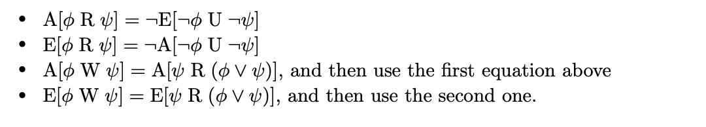

# How to represent a CTL expression?

Consider for a moment that we have a prefix-ordered CTL expression. Let's keep it real simple for now: A AND B.
Now let's consider how we might generate an expression tree from this infix representation:

- Convert to postfix -> AND (A B)
- The first Node is thus a binary operator with 2 children
- So create the AND node, set its children to the subexpressions, respectively

# Adequate sets

EG, EU, EX form adequate set

- A[a U b] = !(E[!b U (!a AND !b)] V EG !b)

